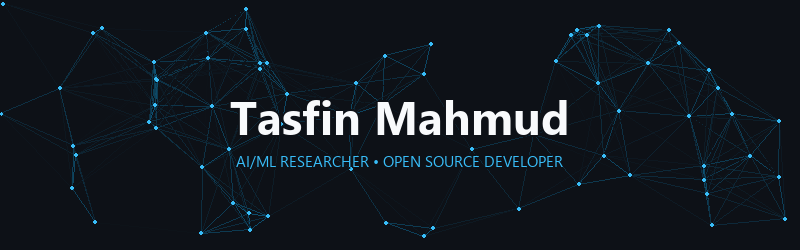

  &nbsp;
  &nbsp;
  &nbsp;
  

---

## About

I'm an undergraduate CS researcher at BRAC University with a minor in Mathematics, focused on **Graph Neural Networks**, **Causal Inference**, and **Reinforcement Learning**. My current research investigates GNN architectures for recommendation systems under causal and bandit feedback settings.

I also build full-stack applications and actively contribute to open-source projects — working toward **Google Summer of Code 2027**.

- 🔬 Researching GNN-based recommendation with causal RL (Pre-Thesis II)
- 🌍 Active contributor to [Rocket.Chat](https://github.com/RocketChat/Rocket.Chat) (40k+ ⭐), [FOSSASIA](https://github.com/fossasia), and [Joplin](https://github.com/laurent22/joplin)
- 📫 Reach me at **tasfinmahmud1@gmail.com**

---

## Open Source Contributions

### [Rocket.Chat](https://github.com/RocketChat/Rocket.Chat) — Active Contributor

| PR | Area | Description |
|----|------|-------------|
| [#40449](https://github.com/RocketChat/Rocket.Chat/pull/40449) | 🔒 Security | Restored Issue Tracker Links with URL scheme validation |
| [#40451](https://github.com/RocketChat/Rocket.Chat/pull/40451) | 🧹 Refactor | Simplified `getNodeIconType` utility with direct returns |
| [#40426](https://github.com/RocketChat/Rocket.Chat/pull/40426) | ✨ Feature | Nested markdown list support in message parser |
| [#40374](https://github.com/RocketChat/Rocket.Chat/pull/40374) | ⚡ Perf | Translation memory cache to reduce redundant API calls |
| [#40353](https://github.com/RocketChat/Rocket.Chat/pull/40353) | ⚡ Perf | `useInfiniteQuery` to prevent UI freeze in message tabs |
| [#40399](https://github.com/RocketChat/Rocket.Chat/pull/40399) | 🐛 Fix | Preserve aspect ratio for URL-embedded images |
| [#40425](https://github.com/RocketChat/Rocket.Chat/pull/40425) | 🐛 Fix | Trim whitespace from IP whitelist entries |
| [#40424](https://github.com/RocketChat/Rocket.Chat/pull/40424) | 🐛 Fix | Replace fragile regex in `isRelativeURL` validation |
| [#40363](https://github.com/RocketChat/Rocket.Chat/pull/40363) | 🐛 Fix | Fix truncation of Livechat transfer comments |

### Other Organizations

| Org | PR | Description |
|-----|----|-------------|
| **FOSSASIA** | [#3441](https://github.com/fossasia/eventyay/pull/3441) | Resolved duplicate imports & bare exceptions in `eventyay` |
| **Joplin** | [#15327](https://github.com/laurent22/joplin/pull/15327) | React Native UI fix for mobile plugins screen |

---

## Research

### [GNN RecSys Benchmark](https://github.com/TasfinMahmud/gnn-recsys-benchmark)

Benchmarking 5 GNN architectures — **LightGCN**, **GCN**, **GAT**, **NGCF**, **GraphSAGE** — for collaborative filtering on the Open Bandit Dataset. BPR training with Recall@K and NDCG@K evaluation.

`Python` `PyTorch` `PyG` `GNNs` `Causal ML`

---

## Tech Stack

---

## GitHub Analytics

  
  

---

Open to collaborating on **open source**, **GNN research**, or **AI/ML projects**.

